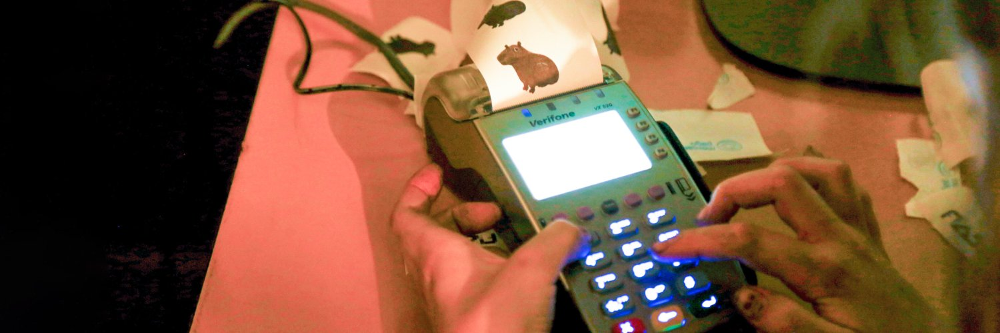

# posnet-image-printer
Random logo printer, for Verifone VX520 and others.

Important: **BMP images from the bmp/ folder ARE NOT COVERED BY MIT License**
**BMPs are property of their respective owners**. Please send me a message if you are the copyright holder and want to remove one of them, as it's very likely fair-use doesn't cover this.

- [01. Cybercirujas](https://cybercirujas.rebelion.digital/)
- [02. Flashparty](https://flashparty.rebelion.digital/index.php/en/)
- [03. Linux](https://es.wikipedia.org/wiki/Archivo:Linux_Logo.jpg)
- [04. Raspberry Pi](https://es.m.wikipedia.org/wiki/Archivo:Raspberry_Pi_OS_Logo.png)
- [05. Exceso Windows](http://github.com/gzalo)
- [06. Boleto de bondi](https://www.linea-39.com.ar/la-empresa/boletos-antiguos/)
- [07. Cara Soldan / Commander keen](https://store.steampowered.com/app/9180/Commander_Keen/?l=latam)
- [08. Revista Replay](https://revistareplay.com.ar/)
- [09. Endif](https://www.instagram.com/endif_ok/)
- [10. Poder Alien](https://www.twitch.tv/elglitch404)
- [11. Floppy disk](https://www.vecteezy.com/vector-art/10563718-floppy-disk-isolated-hd-diskette-old-data-media)
- [12. Right to Repair](https://diligex.com/2022/01/apples-move-towards-the-right-to-repair/)
- [13. Caras del Doom](https://www.idsoftware.com/)
- [14. Linux inside](https://blogs.ugr.es/tecweb/linux-inside/)
- [15. Circuito](https://en.m.wikipedia.org/wiki/File:SR_Flip-flop_Diagram.svg)
- [16. Xonotic](https://en.m.wikipedia.org/wiki/File:Xonotic_icon.svg)
- [17. Carpincho]()
- [18. Joy Division]()
- [19. Daft Punk]()
- [20. Mate]()
- [21. Don Epi]()
- [22. Copas]()
- [23. Posadas Vice]()
- [24. General]()
- [25. Fantasma]()
- [26. Mandelbrot]()
- [27. Sierpinski]()
- [28. Lines]()
- [29. Gatos]()
- [30. Contiene Linux]()
- [31. Mapa cyberciruja]()
- [32. Commodore 64]()
- [33. Z80 inside]()
- [34. Partes de PC]()
- [35. Isaac]()
- [36. Super Hexagon]()
- [37. Tetris]()
- [38. Half-Life]()
- [39. Portal gun]()
- [40. ConectarIgualdad]()